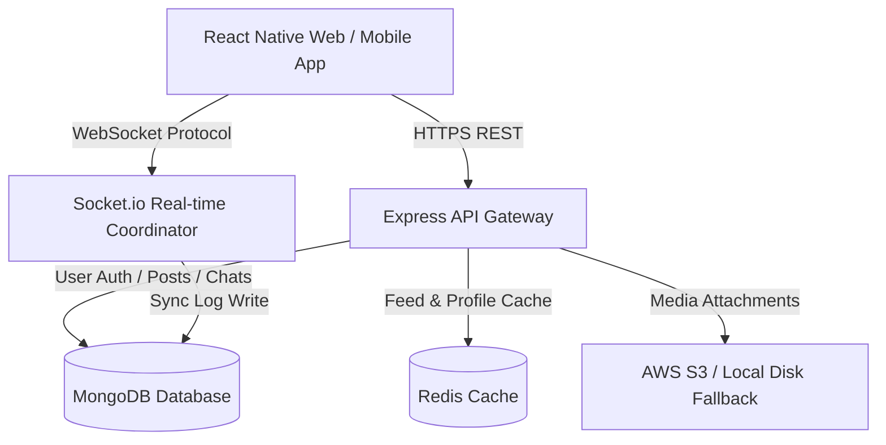

# Aether — Premium Social Media Platform

Aether is a feature-rich, high-performance, and visually stunning social media platform inspired by modern interfaces like Instagram and Facebook. It features a responsive React Native Expo frontend supporting iOS, Android, and Web browsers, paired with a robust Node.js microservices backend architecture utilizing WebSockets and high-performance databases.

---

## 🚀 Key Features

* **Visual Experience**: Built with modern glassmorphic card interfaces, glowing dark-theme gradient glows, and fluid micro-interactions.
* **Socket.io Real-Time Chat**: Live direct messaging with online presence indicators, read receipts, and typing statuses. Supports dynamic split-screen WhatsApp-style layouts on desktop and fluid mobile sheets on narrow screens.
* **Dynamic Feed & Stories**: Instagram-style circular reels for active stories, heart double-tap feed animations, optimistic like increments, and comments overlay panels.
* **Explore & Lookups**: Debounced database search query lookup for active users and a masonry grid displaying public image/video uploads.
* **Interactive Profile Customization**: Modern statistics display, instant follow/unfollow toggle actions, custom avatar selectors, and editable bios with real-time state updates.
* **Secure Authentication**: Password hashing with `bcryptjs` and token-based session tracking with JSON Web Tokens (JWT).
* **Smart Media Upload Engine**: dual-mode file upload handling that utilizes AWS S3 clients when configured, falling back automatically to local static disk storage when running locally.

---

## 🛠️ Tech Stack

### Frontend (Mobile & Web)
* **Core**: React Native, Expo (SDK 51+), Expo Router (File-based routing)
* **Animation & Styling**: Vanilla CSS, React Native Reanimated (Fluid transitions)
* **Vector Icons**: Custom dynamic `SymbolView` using iOS native SF Symbols with dynamic inline SVG vector assets fallback on Web.

### Backend (API & Real-time Services)
* **Server Framework**: Node.js with Express
* **WebSocket Engine**: Socket.io
* **Media Storage**: AWS S3 Client / Multer local disk upload fallback

### Databases & Cache
* **Primary Database**: MongoDB with Mongoose ODM
* **Caching Layer**: Redis (caches feed listings and profiles for high-speed delivery)
* **Virtualization**: Docker Compose (standard container orchestration)

---

## 🏗️ Architecture



---

## ⚙️ How to Run the Project Locally

### Step 1: Start Database Containers
Spin up MongoDB and Redis in the background using Docker:
```bash
# In the project root directory (/socialmedia)
docker compose up -d
```

### Step 2: Start the Backend API Server
Navigate to the backend directory, install packages, and start the development server:
```bash
# From the root directory
cd backend
npm install
npm run dev
```
*The server will boot on port `5001`. Confirm `MongoDB Connected` and `Redis connected` logs in the terminal.*

### Step 3: Run the React Native Expo Frontend
Navigate to the frontend directory, install packages, and start the client:
```bash
# From the root directory
cd ../frontend
npm install
npm run web
```
*Press **w** to view the app directly in your web browser. You can resize the browser window to test the fluid responsiveness.*

---

## 🛠️ Resolved UI/UX Enhancements

This project includes customized configurations resolving crucial cross-platform layout challenges:
1. **Status Bar & Notch Padding (iOS)**: Applied platform-specific safe area top insets preventing screen titles and the Chats `+` button from overlapping with native iPhone notches.
2. **Layering Index Fix (Web)**: Fixed a z-index conflict by setting all modal overlays (including the **Edit Bio** modal and contact searches) to `zIndex: 2000` with fixed viewport positions. They now sit above the navigation bar for unrestricted clicks.
3. **TypeScript Integrity**: The custom vector system is 100% type-checked via a declared `weight` prop mapping straight down to native Swift-based visual attributes.
